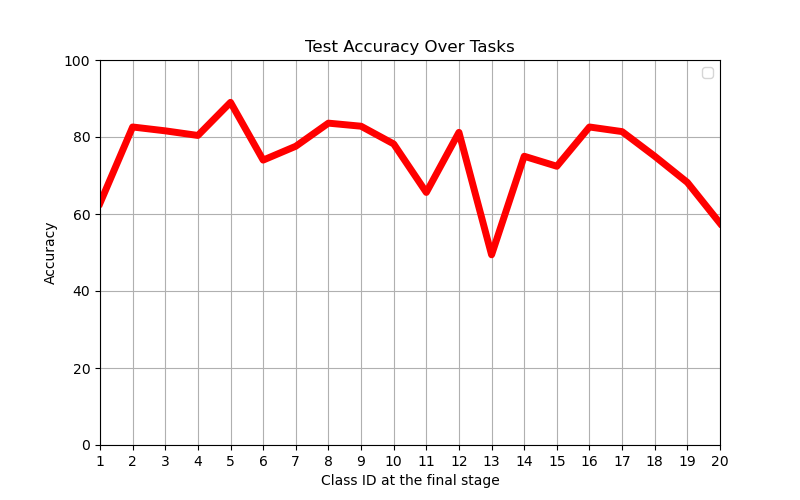

## **CH-HNN Project Code Repository**

**CH-HNN** is a neural network model for **hybrid neural networks in continual learning**, inspired by **cortico-hippocampal circuits**. This repository contains the code needed to replicate the experiments described in the associated manuscript submitted to **Nature Communications**.

## **System Requirements**
- **Operating System**: Ubuntu 20.04
- **Python Version**: 3.9.12
- **Dependencies**:

matplotlib==3.5.1
numpy==1.21.5
pygame==2.5.2
scikit_learn==1.0.2
torch==1.11.0+cu115
torchvision==0.12.0+cu115
tqdm==4.64.0

##**Installation**

Clone the repository and install the required packages:
```bash
git clone https://github.com/qqish/CH-HNN
cd CH-HNN
pip install -r requirements.txt
```

##**Preparation**

To extract embedding features from **CIFAR-100** or **TinyImageNet**, run:
```bash
python get_embedding_clip.py
```
This process takes about 5 minutes.

##**Example Demo**

To demonstrate class-incremental learning on CIFAR-100 with CH-HNN model, execute:
CH-HNN model:
```bash
python demo_test.py --ep-inference --dataset 'cifar100'
```

This will produce accuracy results for each of the 20 classes, saving them as "test_accuracy_results.png":


For the baseline model, use:

Baseline model:
```bash
python demo_test.py --dataset 'cifar100'
```

Results are similar to the above:
 

##** Training Method **

To train CH-HNN model, run::
```bash
python manager.py --ep-inference --dataset 'cifar100' --scenario 'class-incre'
```
Pretrained ANN models are available in the ANN_Prior directory for the following datasets:

- **sMNIST**
- **pMNIST**
- **CIFAR-100**
- **Tiny-ImageNet**

Select datasets with the `--dataset` flag and learning scenarios (class-incremental or task-incremental) with the `--scenario` flag.

The `ANN_Prior` directory also contains ANN models trained on **ImageNet**.

To train ANNs for learning related-episode knowledge: 

(1) **Generate Episode Similarities**:
```bash
    python generate_task_similarity.py
```
(2) **Train the ANN with Generated Similarities**:
```bash
    python manager.py
```
(3) **Customize the Training Design**:
(_continue, _enhanced, or _task) in 'manager.py'  to change the training setup for ANNs.
